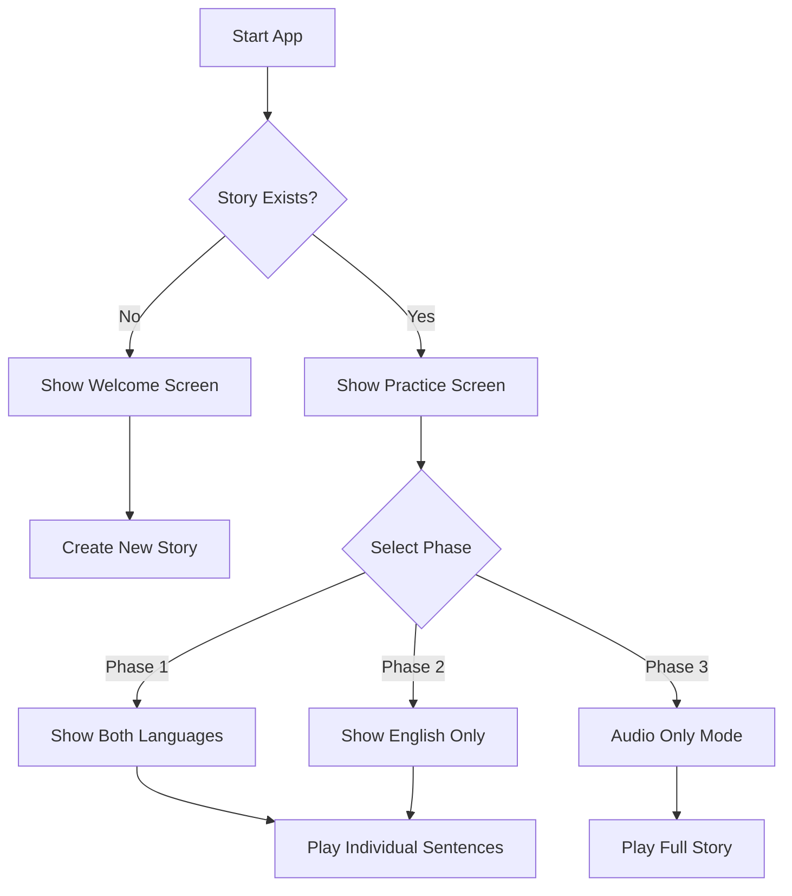

# Fluency Coach

An application that generates stories, in both the native and the target language, and helps users to practice and improve their pronunciation and intonation.

## Running the Application Locally

1. Clone the repository and install dependencies:
    ```bash
    # Clone repository
    git clone [your-repo-url]
    cd fluency-coach

    # Install server dependencies
    cd server
    npm install

    # Install client dependencies
    cd ../client
    npm install
    ```

2. Start the servers:
    ```bash
    # Terminal 1: Start backend server
    cd server
    npm run dev

    # Terminal 2: Start frontend server
    cd client
    npm run dev
    ```

3. Access the application:
    - Open `http://localhost:5173` in your browser
    - Ensure your browser supports speech synthesis

## Using the Application

### Step-by-Step Practice Guide

1. Initial Setup:
    - Click "Create New Story" to generate a practice story
    - Stories contain English and Spanish versions of the same text

2. Practice Phases:
    - **Phase 1**:
        - Read and listen to both languages
        - Compare English and Spanish texts
        - Use play buttons to hear proper pronunciation

    - **Phase 2**:
        - Focus on English text only
        - Practice pronunciation without Spanish reference

    - **Phase 3**:
        - Listen to full story in English
        - Practice speaking without reading

3. Best Practices:
    - Start with short sentences
    - Repeat each phase multiple times
    - Record yourself for comparison
    - Practice daily for best results

## Application Flow



## Technical Implementation

### Core Components

1. Frontend (React + Vite):
    - `PracticeScreen.jsx`: Main practice interface
    - `App.jsx`: Root component
    - `App.css`: Styling and layout

2. Backend (Express):
    - `index.js`: Server setup and API endpoints
    - Story management and persistence

### Key Features

1. Speech Synthesis:
    ```javascript
    const speak = (text, lang = 'en-US') => {
        const utterance = new SpeechSynthesisUtterance(text);
        utterance.lang = lang;
        utterance.rate = 0.9;
        window.speechSynthesis.speak(utterance);
    };
    ```

2. Phase Management:
    - State-based UI rendering
    - Conditional content display
    - Progressive learning approach

### Algorithm Concepts

1. Story Structure:
    ```javascript
    {
        title: string,
        sentences: [
            {
                english: string,
                spanish: string,
                audioUrl: string
            }
        ]
    }
    ```

2. Phase Logic:
    - Phase 1: Display index % 2 === 0
    - Phase 2: Display index === 0
    - Phase 3: Audio only

## Future Enhancements

1. Language Support:
    - Add Japanese support
    - Implement language selection
    - Support multiple writing systems

2. Audio Features:
    - Custom voice selection
    - Speed control
    - Pitch adjustment
    - Record user's voice

3. Learning Features:
    - Progress tracking
    - Pronunciation scoring
    - Vocabulary lists
    - Practice reminders

4. UI Improvements:
    - Mobile responsiveness
    - Dark/light themes
    - Customizable layouts
    - Animation effects

## Current Limitations

1. Speech Synthesis:
    - Robotic voice quality
    - Limited language support
    - Browser dependency

2. Story Management:
    - Fixed story content
    - No persistence
    - Limited editing

## Contributing

Guidelines for contributing:
1. Fork the repository
2. Create feature branch
3. Submit pull request
4. Follow code style

## License

MIT License - See LICENSE file for details

## OpenAI Text-to-Speech Integration

The application uses OpenAI's TTS service for higher quality voice synthesis. To enable this feature:

1. Get your OpenAI API key:
   - Visit https://platform.openai.com
   - Sign in or create an account
   - Go to API Keys section (top-right menu)
   - Click "Create new secret key"
   - Copy the key immediately (you won't be able to see it again)

2. Set up environment variables:
   ```bash
   # In the server directory
   cp .env.example .env
   ```

3. Edit your `.env` file:
   ```env
   OPENAI_API_KEY=your-api-key-here
   ENABLE_OPENAI_TTS=true
   ```

4. Restart your server for changes to take effect

### Voice Selection
- English text uses the 'nova' voice
- Spanish text uses the 'alloy' voice

### Fallback Behavior
The application will automatically fall back to browser TTS if:
- OpenAI API key is missing or invalid
- OpenAI TTS is disabled in settings
- Network errors occur
- API rate limits are exceeded

### Cost Considerations
- OpenAI's TTS service is not free
- Charges are based on character count
- Monitor usage in your OpenAI dashboard
- Set spending limits to avoid unexpected charges

### Troubleshooting
If you see the red warning banner:
1. Check that your API key is correctly set in `.env`
2. Verify `ENABLE_OPENAI_TTS=true` in `.env`
3. Restart the server
4. Clear browser cache and refresh

## Word Meaning Hover Feature

The application includes an interactive word translation feature that helps users understand English text:

### How to Use

1. Hold the Alt key (or Command key on Mac) to activate the meaning mode
2. Hover over any English word to see:
   - The word itself
   - Its Spanish translation
   - A detailed explanation in Spanish

### Features

- Works only on English text sections
- Activates only with clean Alt/Command press (no other modifier keys)
- Shows contextual explanations for better understanding
- Displays tooltips that stay above all other content

### Technical Notes

- Translations are managed through a centralized translation service
- Tooltips are positioned dynamically based on viewport space
- The feature is automatically disabled for Spanish text sections
- Uses styled-components for consistent styling

### Keyboard Support

- Alt key (Windows/Linux)
- Command key (MacOS)
- Feature disables automatically when key is released
- Prevents activation with modifier key combinations (Shift+Alt, Ctrl+Alt, etc.)
